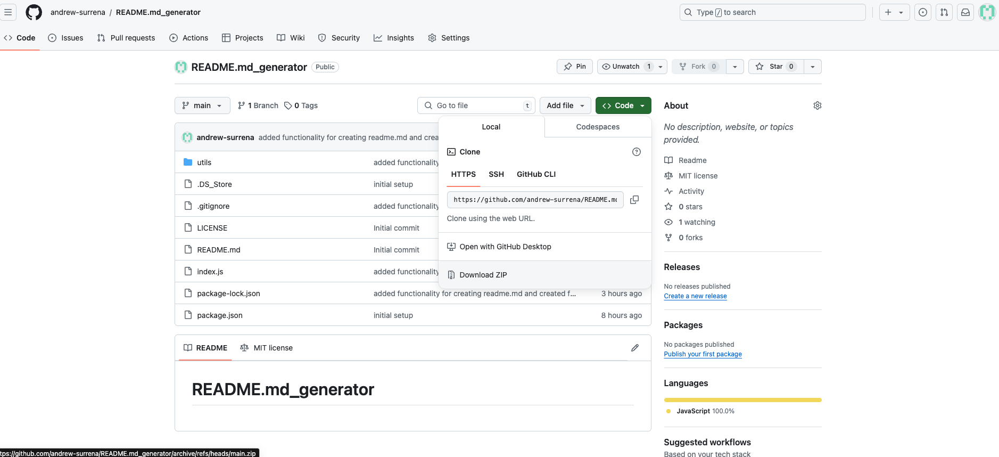

# README.md_generator

## Description

Using this node script, you'll be able to quickly create a README.md file for your application!

This application was created to make it easier to create a fully featured professional ReadMe to share your project with the world.

While working on this project, I was able to practice utilizing node and its functionality including writing new files using "fs.writeFile" with Node's standard library package, using the "inquirer" module provided by the online Node Package Manager (npm) resource, as well as utilizing my own modularized code.

## Table of Contents
- [Installation](#installation)
- [Usage](#usage)
- [Credits](#credits)
- [License](#license)

## Installation

To install the README.md_generator application, simply download the README.md_generator directory from github - [Click to access repo](https://github.com/andrew-surrena/README.md_generator)



Click "Download ZIP" to access folder

## Usage

To utilize app, start by accessing the folder in your terminal:


Next, download the necessary modules by running the line: 
```
npm i
```

Now, you can run the application by running the line:
```
node index.js
```

Answer the prompts provided to complete your professional README.md file.

Access video demo: 

## Credits
Special thanks to the following instructors for their help:
* Leif Hetland
* Daniel Ceballos
* Michael Hodges

The following technologies were used:
* npm inquirer
* node
* JavaScript

## Questions/How to Contribute

If you have any questions please reach out to me at andrewsurrena@gmail.com

You can find my other projects on my github page at https://github.com/andrew-surrena